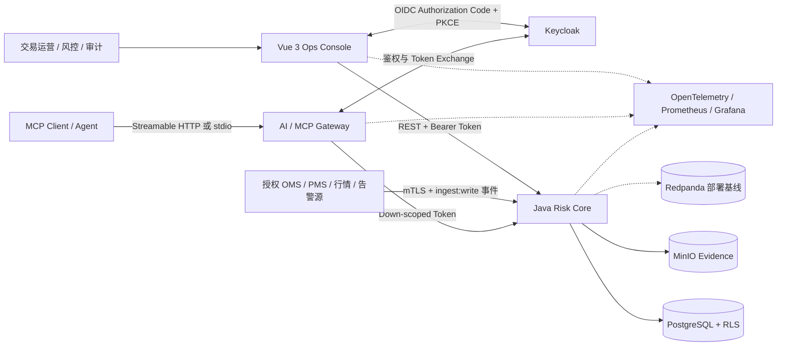

# 金融交易风控智能运维助手

[](https://github.com/jadenmong/financial-trading-risk-aiops-assistant/actions/workflows/ci.yml)
[](https://github.com/jadenmong/financial-trading-risk-aiops-assistant/actions/workflows/security.yml)
[](LICENSE)
[](package.json)
[](apps/risk-core/pom.xml)
[](apps/market-adapter/pyproject.toml)

面向交易运营、风控分析、报告审批、审计与平台值班场景的**机构级只读 AIOps 助手参考实现**。项目将确定性金融计算、真实数据接入边界、只读 MCP 工具、证据链、权限边界、持久化工作流和可观测性整合在同一套 monorepo 中，便于演示、验证和二次开发。

**核心原则：AI 负责归纳与解释，金融数值、权限判断和工作流状态由确定性代码控制。**

[快速开始](#快速开始) · [系统架构](#系统架构) · [生产化能力](#生产化能力) · [MCP-接入](#mcp-接入) · [验证状态](#验证状态) · [文档导航](#文档导航)

> [!IMPORTANT]
> 所有内置账户、交易、行情和异常均为虚构数据。系统不具备下单、撤单、改单、持仓修改或风险限额修改能力，不预测或承诺收益，也不构成投资建议。

> [!NOTE]
> 这是生产化设计的参考实现，不代表已经通过任何机构、监管、SOC 2、ISO 27001 或长期生产运行认证。详见[不宣称认证](docs/no-certification.md)。

## 项目亮点

| 方向 | 已实现能力 |
| --- | --- |
| 确定性风险计算 | Java `BigDecimal` 计算 A 股与股指期货敞口、PnL、保证金、杠杆与六类风险限额 |
| 交易后对账 | 对比 OMS 与券商订单/成交，识别重复成交、孤立成交、数量、状态和币种差异 |
| 只读 AI 工具 | 8 个 MCP 工具覆盖行情、风险、对账、报告预览、事故上下文、系统健康和审计搜索 |
| Agent 治理 | 固定 DAG、显式工具 allowlist、模型预算、超时与有限降级；诊断运行和步骤可持久化 |
| 报告治理 | 日报预览与正式草稿分离，正式报告采用 maker-checker 审批、乐观锁和不可变对象存储 |
| 事件接入 | `/internal/v1/events` 接收授权源事件，支持幂等、乱序/未来时间处置、原始事件留痕 |
| 事故闭环 | 事故创建、确认、关闭和证据关联 API，支撑平台值班与处置记录 |
| 证据与审计 | 响应携带版本、观测时间、trace ID 和 SHA-256 证据引用；证据可查询，审计不可写时 fail closed |
| 生产边界 | `production` readiness 拒绝 reference/sample/fake 路径、缺失 mTLS、缺失 secret 或非授权行情源 |
| 纵深安全 | OIDC + PKCE、token exchange/downscope、RBAC + ABAC、PostgreSQL RLS 与网络分区 |
| 工程化交付 | OpenAPI/AsyncAPI/JSON Schema、CI、安全扫描、Compose、Helm、OTel、Grafana、k6 与演练手册 |

## 系统架构



关键边界：

- `AI Gateway` 是 MCP 鉴权、工具发现和 Agent 编排边界，校验 `Origin`、`Host`、issuer、audience、expiry 与 scope。
- `Risk Core` 是授权、金融计算、报告治理和审计的最终执行点；即使 Gateway 已鉴权，Core 仍会执行 RBAC、账户级 ABAC 和 RLS。
- 金额、价格、数量、敞口与比率在 JSON 中统一使用十进制字符串，TypeScript 层不执行金融数值计算。
- `reference / staging / production` 明确分层；`production` readiness 会拒绝 reference/sample/fake 路径、缺失 mTLS、缺失 secret、localhost issuer 或非授权行情源。
- `reference` profile 使用固定仿真数据与 deterministic fake model，可离线复现；生产 profile 禁止开发身份头、内存持久化、用户 token 透传和公开行情源作为真相源。
- stdio 模式默认连接内置仿真数据源；HTTP 模式由 Gateway 调用 Risk Core。
- Redpanda 已提供 Compose/Helm 与事件契约基线；Risk Core 已持久化接入事件处置、工作流状态、outbox、证据和事故记录。

更完整的设计说明见[架构与关键边界](docs/architecture.md)和[架构决策记录](docs/adr/)。

## 服务与技术栈

| 组件 | 技术 | 职责 |
| --- | --- | --- |
| `apps/ops-console` | Vue 3、TypeScript、Element Plus | 风险概览、账户风险、对账差异、Agent 时间线、事故处置、报告审批、审计查询 |
| `apps/ai-gateway` | Node.js 22、TypeScript、MCP SDK v2 | `/mcp`、stdio、OIDC、scope 过滤、8 个只读工具、模型路由、生产 readiness guard 与审计 |
| `apps/risk-core` | Java 21、Spring Boot 4.1、MyBatis | 确定性风险计算、对账、事件接入、持久化工作流、事故闭环、授权、证据与审计 |
| `apps/market-adapter` | Python 3.12、FastAPI | 可选公开行情适配器；默认关闭，不能成为交易或持仓真相源 |
| `contracts` | OpenAPI、AsyncAPI、JSON Schema | REST、事件接入与 MCP 响应的版本化契约 |
| `infra` | Compose、Helm、Keycloak、OTel、Grafana | 本地编排、身份、可观测性、runtime mode 与部署基线 |

```text
.
├─ apps/                 # Console、Gateway、Risk Core、Market Adapter
├─ contracts/            # OpenAPI、AsyncAPI、JSON Schema
├─ docs/                 # 架构、安全、模型、运维与验证证据
├─ evals/                # 越权与提示注入评测集
├─ infra/                # Compose、Helm、Keycloak、OTel、Grafana
├─ load-tests/           # k6 场景
├─ prompts/              # 版本化提示词
└─ scripts/              # 契约、供应链与构建校验脚本
```

## 生产化能力

本项目保持“金融交易风控智能运维助手”定位，不进入交易执行关键路径。生产化改造聚焦于真实数据接入、持久化状态、证据化诊断、事故处置和运维审计。

| 能力 | 接口或机制 | 生产边界 |
| --- | --- | --- |
| 只读源数据接入 | `POST /internal/v1/events` | 生产要求 mTLS + `ingest:write` scope；事件写入原始表并记录处置结果 |
| 风险与对账查询 | `GET /api/v1/risk-snapshots`、`GET /api/v1/reconciliation-breaks` | 只读查询，账户级 ABAC + PostgreSQL RLS |
| 诊断工作流 | `POST /api/v1/diagnoses`、`GET /api/v1/diagnoses/{id}` | 幂等创建，固定 DAG，运行和步骤持久化 |
| 报告治理 | `GET/POST /api/v1/reports`、`POST /api/v1/reports/{id}/decisions` | maker-checker、`If-Match` 乐观锁、批准内容不可变 |
| 证据与审计 | `GET /api/v1/evidence/{id}`、`GET /api/v1/audit-events` | SHA-256 内容寻址，审计 fail closed |
| 事故处置 | `GET/POST /api/v1/incidents`、`POST /api/v1/incidents/{id}/ack`、`POST /api/v1/incidents/{id}/close` | 仅记录运维处置，不修改交易、持仓或限额 |
| 生产就绪门禁 | Risk Core 与 AI Gateway readiness | `APP_RUNTIME_MODE=production` 时拒绝 reference/sample/fake、缺失 mTLS、缺失 secret、localhost issuer 和非授权行情源 |

## 快速开始

### 方式一：Docker Compose 体验完整平台

前置条件：Git、Docker Engine 与 Docker Compose v2。

```bash
git clone https://github.com/jadenmong/financial-trading-risk-aiops-assistant.git
cd financial-trading-risk-aiops-assistant
docker compose up --build -d
docker compose ps
```

首次构建和启动需要等待镜像下载、数据库就绪与 Keycloak realm 导入。可通过以下地址访问：

| 服务 | 地址 | 用途 |
| --- | --- | --- |
| Ops Console | <http://localhost:5173> | 业务控制台 |
| AI/MCP Gateway | <http://localhost:3000/health/ready> | Gateway 就绪检查；MCP 端点为 `/mcp` |
| Risk Core | <http://localhost:8080/actuator/health/readiness> | 核心服务就绪检查 |
| Keycloak | <http://localhost:8081> | OIDC 与参考 realm |
| Grafana | <http://localhost:3001> | 可观测性面板 |
| Prometheus | <http://localhost:9090> | 指标查询 |

参考环境内置账号仅用于本机演示：

| 角色 | 用户名 | 密码 |
| --- | --- | --- |
| 风控分析员 | `risk-analyst-a` | `reference-analyst-only` |
| 报告审批人 | `report-approver-b` | `reference-approver-only` |
| 审计员 | `auditor` | `reference-auditor-only` |
| Keycloak 管理员 | `admin` | `reference-admin-only` |
| Grafana 管理员 | `admin` | `reference-grafana-only` |

停止服务：

```bash
docker compose down
```

> [!WARNING]
> 上述共享凭据、开发模式和本地端口映射只属于 `reference` 环境，禁止带入生产。CI 已验证 Compose 配置和三个应用镜像构建；全栈启动、恢复与负载演练的最新状态请以[验证状态](docs/evidence/verification-status.md)为准。

### 方式二：运行本地检查与 MCP smoke

前置条件：Node.js 22、Java 21、Python 3.12。Java 构建使用仓库内 Maven Wrapper，不要求全局安装 Maven。

```bash
npm ci
python -m pip install -e "apps/market-adapter[test]"
npm run check
npm run smoke
```

`npm run check` 会依次执行 Node/Java/Python 测试、类型检查、契约校验、供应链锁校验、安全评测和应用构建。只想快速验证 MCP 仿真数据时，执行 `npm ci && npm run smoke` 即可。

## MCP 接入

所有 MCP 工具均为业务只读、幂等且默认不访问开放世界：

| 工具 | 所需 scope | 说明 |
| --- | --- | --- |
| `get_market_snapshot` | `market:read` | 行情快照、新鲜度、质量标记与证据 |
| `get_position_risk` | `risk:read` | 仓位、敞口、PnL、保证金与限额突破 |
| `reconcile_orders` | `reconciliation:read` | OMS/券商订单成交差异与证据 |
| `generate_daily_report` | `report:preview` | 生成不落盘的日报预览；正式草稿走 REST 工作流 |
| `get_incident_context` | `incident:read` | 读取事故状态、证据 ID 与运维上下文 |
| `get_system_health` | `system:read` | 读取平台健康状态与未关闭事故数量 |
| `explain_reconciliation_breaks` | `reconciliation:read` | 基于确定性对账结果解释差异原因 |
| `search_audit_events` | `audit:read` | 按 trace ID 或 subject 查询追加式审计事件 |

所有工具返回统一 envelope：

```text
{ schemaVersion: "1.0", ok, data/error, meta }
```

`meta.evidenceRefs` 保存内容寻址的 SHA-256、数据版本与观测时间，便于复核和追踪。

本地 MCP 客户端可直接通过 stdio 使用确定性仿真数据，无需模型密钥或 Docker：

```json
{
  "mcpServers": {
    "risk-aiops": {
      "command": "npm",
      "args": ["run", "start:stdio", "-w", "@risk-aiops/ai-gateway"],
      "cwd": "/absolute/path/to/financial-trading-risk-aiops-assistant"
    }
  }
}
```

Windows 可将 `cwd` 写成正斜杠路径，例如 `D:/projects/financial-trading-risk-aiops-assistant`。Compose 的参考 HTTP 模式使用 `Bearer reference-token`；非参考环境必须使用 OIDC access token、正确 audience 与所需 scope。

## 配置与模型

仓库默认使用 `APP_RUNTIME_MODE=reference`、`REFERENCE_MODE=true`、`REFERENCE_AUTH=true` 和 `MODEL_PROVIDER=fake`，因此 CI、smoke 和 Compose 不需要外部模型密钥。真实模型仅用于受控的手工环境；配置字段见 [.env.example](.env.example) 和 [Gateway 配置示例](apps/ai-gateway/.env.example)。

生产模式必须显式设置 `APP_RUNTIME_MODE=production`，并提供真实 OIDC issuer、Gateway confidential client secret、服务端 mTLS、外部 secret store、授权行情源、PostgreSQL、Keycloak、MinIO/WORM 对象存储和 Redpanda。Risk Core 与 AI Gateway 的 readiness 会在发现 reference/sample/fake 路径或关键生产依赖缺失时返回 `DOWN`。

模型调用受以下硬边界约束：

- 单次调用预算 8 秒；单次运行最多 12 个 step、6 次模型调用、30 秒和估算 0.25 美元。
- 仅 timeout、429、5xx 或熔断可触发模型降级；鉴权失败、安全拒绝和 Schema 错误不降级。
- 模型输出始终视为不可信输入，不能修改授权、预算、金融计算结果或交易状态。
- OpenAI/Anthropic 的真实密钥不得写入仓库，应由外部 secret store 注入。

完整限制、已知风险与评测范围见[模型卡](docs/model-card.md)。

## 验证状态

截至 **2026-08-10**：

| 范围 | 状态 |
| --- | --- |
| `npm run check` 全量本地检查 | `PASS` |
| Node 类型检查、8 个测试套件 / 22 个测试、Gateway 与 Console 构建 | `PASS` |
| Java 风险公式、安全守卫与生产 readiness 测试；12 个测试、1 个 Testcontainers 测试因本机无 Docker 跳过；可执行 JAR 构建 | `PASS_LOCAL` |
| Python 适配器测试 | `PASS` |
| 100 条越权/提示注入 fake-model eval | `PASS`，50/50 拒绝，泄漏 0 |
| 契约校验 | `PASS`，2 个 JSON Schema、13 个事件 topic 与生产 REST 契约 |
| PostgreSQL Testcontainers migration、Compose 三应用镜像构建 | `PASS_CI` / 本机 Docker 缺失时跳过 |
| Gitleaks、Trivy、依赖审计、三语言 CodeQL | `PASS_CI` |
| Compose 全栈运行、k6 10 分钟压测、kind/Helm smoke、备份恢复、真实模型 smoke | `NOT RUN` |

证据与边界以[验证状态总表](docs/evidence/verification-status.md)和[本地验证记录](docs/evidence/local-verification-2026-08-10.md)为准。项目明确区分“设计目标”“测试脚本存在”和“实测通过”。

## 安全与生产边界

- 业务交易面只读；报告草稿、审批和诊断状态属于受控运维工作流，不会产生交易指令。
- 非本地环境必须配置真实 issuer、audience、Gateway 客户端密钥引用、TLS 和严格的 Host/Origin allowlist。
- 生产环境必须启用 PostgreSQL、Keycloak、MinIO/WORM 对象存储、Redpanda、外部 secrets、服务间 mTLS 与网络策略，不得使用 reference profile 的共享身份、固定数据、sample core、fake model 或公开行情源作为真相源。
- 生产 readiness 会拒绝 `REFERENCE_MODE=true`、`REFERENCE_AUTH=true`、`RISK_CORE_MODE=sample`、`MODEL_PROVIDER=fake`、localhost issuer、缺失对象存储凭据、缺失 source mTLS 或非 licensed 行情源。
- 内部接入 API 只接收授权源事件，不提供下单、撤单、改单、持仓修改或风险限额修改接口。
- 发现安全问题时请遵循 [SECURITY.md](SECURITY.md)，不要通过公开 Issue 披露敏感漏洞。

## 文档导航

| 主题 | 文档 |
| --- | --- |
| 架构 | [架构与边界](docs/architecture.md) · [ADR](docs/adr/) · [API 契约](contracts/openapi/risk-aiops-v1.yaml) |
| 安全 | [威胁模型](docs/security/threat-model.md) · [数据分类](docs/security/data-classification.md) · [安全策略](SECURITY.md) |
| AI | [模型卡](docs/model-card.md) · [报告合成提示词](prompts/v1/report-synthesis.md) |
| 运维 | [运行手册](docs/operations/runbook.md) · [事故响应](docs/operations/incident-response.md) · [SLO 与恢复](docs/operations/slo-and-recovery.md) |
| 证据 | [验证状态](docs/evidence/verification-status.md) · [本地验证记录](docs/evidence/local-verification-2026-08-10.md) |

## 贡献与许可证

提交前请阅读 [CONTRIBUTING.md](CONTRIBUTING.md)，并至少运行 `npm run check`。本项目采用 [MIT License](LICENSE)。
